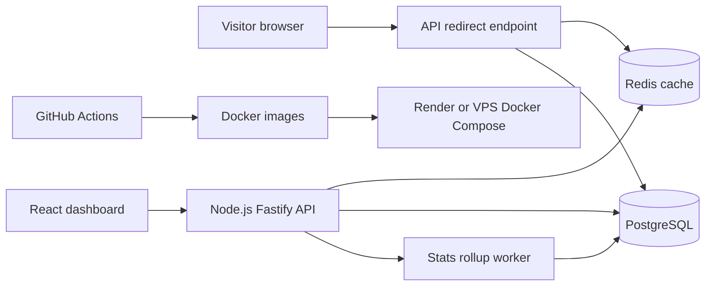

# Shortlink

URL shortener and link analytics tool for portfolio/interview use.

The goal is not to clone Bitly. The goal is a small production-shaped system that proves backend design, database indexing, caching, rate limiting, analytics, Docker, CI/CD, and a clean dashboard.

## Architecture



## Stack

| Area | Choice | Why this instead of alternatives |
| --- | --- | --- |
| Backend | Node.js LTS, TypeScript, Fastify | Fastify gives route schemas, plugins, and cheap `inject` tests. Express is familiar but looser. NestJS is strong but too much ceremony for this project. |
| Database | PostgreSQL | Short links, owners, click events, and rollups are relational. Unique constraints and indexes are the real collision guard. MongoDB adds flexibility we do not need. |
| ORM | Prisma | Type-safe client and migrations are enough. Raw SQL stays available for heavier analytics queries. TypeORM is more decorator-heavy. |
| Cache/rate limit | Redis | Shared cache across containers and simple `INCR`/TTL rate limiting. In-memory cache breaks when the API scales beyond one process. |
| Frontend | React + Vite | Fast dashboard build with fewer moving parts. Next.js is useful for SEO/server rendering, but this is an authenticated dashboard plus public redirect API. |
| Charts | Recharts | Simple React charts for time series and breakdowns. D3 is more flexible but slower to ship. |
| DevOps | Docker Compose, GitHub Actions | One local/prod shape for API, web, PostgreSQL, Redis. Actions covers lint/test/build and can deploy to Render or VPS. |

## Target Repo Shape

```text
backend/      Fastify API, Prisma, tests
frontend/     React dashboard
packages/
  shared/     shared types only if duplication appears
prisma/
  schema.prisma
  migrations/
docs/
  PLAN.md
  ARCHITECTURE.md
  DEVOPS.md
  INTERVIEW_NOTES.md
design.md
docker-compose.yml
```

## Core Flows

1. User creates a link from the dashboard.
2. API generates a random base62 short code.
3. PostgreSQL unique constraint accepts it or rejects a collision.
4. API retries on collision instead of pre-checking.
5. Redirect endpoint resolves `/:code` from Redis first, then PostgreSQL.
6. Click event is recorded with privacy-safe metadata.
7. Dashboard reads aggregated stats, not raw click rows by default.

## First Build Milestone

Ship the smallest vertical slice:

1. `POST /links` creates a short link.
2. `GET /:code` redirects.
3. `GET /links/:id/stats` returns clicks per day.
4. Dashboard lists links and shows one time-series chart.
5. Docker Compose starts API, web, PostgreSQL, and Redis.

## Documentation

- [docs/PLAN.md](docs/PLAN.md) - implementation phases and commit slices
- [docs/ARCHITECTURE.md](docs/ARCHITECTURE.md) - database, API, cache, rate limit, collision handling
- [docs/DEVOPS.md](docs/DEVOPS.md) - Docker, CI/CD, Render/VPS deployment
- [docs/INTERVIEW_NOTES.md](docs/INTERVIEW_NOTES.md) - hard problems and answers
- [design.md](design.md) - dashboard design direction
- [CODEX_NEXT_SESSION.md](CODEX_NEXT_SESSION.md) - paste into a new Codex session to continue

## Docs Consulted

- Fastify TypeScript/testing docs: https://github.com/fastify/fastify/tree/main/docs
- Prisma README/config examples: https://github.com/prisma/prisma
- Vite guide: https://vite.dev/guide/
- PostgreSQL indexes and constraints: https://www.postgresql.org/docs/current/indexes.html and https://www.postgresql.org/docs/current/ddl-constraints.html
- Redis `INCR` rate limiter pattern: https://redis.io/docs/latest/commands/incr/
- Docker Compose file reference: https://docs.docker.com/reference/compose-file/
- GitHub Actions workflow syntax: https://docs.github.com/en/actions/reference/workflows-and-actions/workflow-syntax
