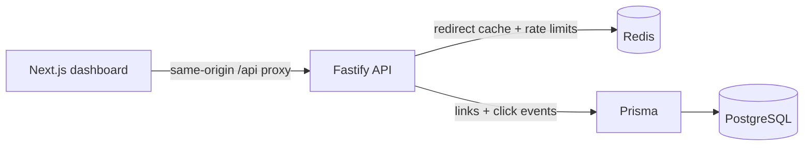

# Shortlink

[](./README.md)
[](./README.vi.md)

Shortlink combines a Fastify API, PostgreSQL persistence through Prisma, Redis-backed caching and rate limiting, and a Next.js dashboard for managing links and inspecting click analytics.

## Live demo

- Web dashboard: [short-link-1-46io.onrender.com](https://short-link-1-46io.onrender.com/)
- API: [short-link-wy7x.onrender.com](https://short-link-wy7x.onrender.com/)
- API health check: [healthz](https://short-link-wy7x.onrender.com/healthz)

The demo runs on Render's free tier, so the first request may take a few seconds while a service wakes up.

## What it demonstrates

- Create short links from any `http` or `https` destination.
- Generate collision-safe short codes or reserve a custom alias (`3–32` characters).
- Redirect through a Redis cache so the common path does not need a database read.
- Inspect total clicks, unique visitors, clicks by day, referrers, browsers, and devices.
- Disable links or set an expiration date without waiting for the cache TTL.
- Apply Redis-backed rate limits to link creation and redirects.
- Hash IP addresses with HMAC before storing them; raw IPs are never persisted.
- Use loading skeletons, search, status filters, retry states, and responsive dashboard views.

## Architecture



The redirect path is deliberately short: validate the code, check Redis, verify status/expiry, record analytics, and return a `302`. Analytics failures are swallowed after the redirect is otherwise valid, so a telemetry problem cannot take down link resolution.

## Engineering decisions

| Decision | Why |
| --- | --- |
| Redis on the redirect path | Short links are read-heavy. A 10-minute cache avoids a PostgreSQL lookup for hot links, while updates explicitly invalidate the cached value. |
| HMAC-hashed IPs | Unique-visitor counts need a stable per-installation identifier, but storing raw IP addresses is unnecessary. `IP_HASH_SECRET` makes the digest non-reversible without the secret. |
| Analytics after link validation | Click recording is useful but secondary to redirect latency. The insert is isolated from the redirect response and errors do not block the user. |
| Retry generated codes | Random codes can collide. Generated aliases retry a bounded number of times; user-supplied aliases return `409` when already taken. |
| On-demand aggregation | The dashboard asks for up to 90 days and aggregates the selected link's events at read time. This keeps the write path simple for a portfolio-sized system. |

## Testing and CI

The repository includes API tests for redirects, validation, cache behavior, rate limiting, analytics, and health/readiness checks. The GitHub Actions workflow runs on pushes to `main` and pull requests:

```bash
npm run typecheck
npm test
npm run build
docker compose build
```

For an end-to-end local check, start the stack and run:

```bash
npm run smoke
```

## Demo scope and authentication

Authentication is intentionally omitted from the current portfolio demo. Dashboard operations use a seeded demo workspace (`demo@shortlink.local`); the `User` model exists so ownership is represented in the data model without pretending this repository already provides production account security. A production extension would add session/token authentication and owner-scoped authorization around the existing link service.

## Local Docker

Copy the sample environment if needed:

```bash
cp .env.example .env
docker compose up --build
```

The `migrate` and `seed` services prepare demo data before the API starts. Open the dashboard at `http://localhost:3000`. The API exposes:

- `GET http://localhost:4000/healthz` — process health
- `GET http://localhost:4000/readyz` — PostgreSQL and Redis readiness

## Local Node

Requires Node.js 22+ and a PostgreSQL/Redis environment matching `.env.example`.

```bash
npm install
npm run db:generate --workspace @shortlink/backend
npm run typecheck
npm test
npm run build
```

Apply migrations against `DATABASE_URL` with:

```bash
npm run db:deploy --workspace @shortlink/backend
```

## Deploy

The simplest production shape is one Docker Compose host running PostgreSQL, Redis, the API, and the web service together. Render or a VPS can also run the API and web as split Docker services.

Required production values include:

```bash
POSTGRES_PASSWORD=<strong password>
IP_HASH_SECRET=<random long secret>
NODE_ENV=production
WEB_PORT=3000
```

For split services, configure the API with `DATABASE_URL`, `REDIS_URL`, `IP_HASH_SECRET`, and `TRUSTED_PROXY` when it sits behind a proxy. Build the web service with `API_INTERNAL_ORIGIN` pointing at the API origin. The backend image runs `db:deploy` before starting the server, and the deployment should be checked with `/readyz` and:

```bash
WEB_BASE_URL=https://your-web.example.com npm run smoke
```

## Project layout

```text
backend/src/
├── links.ts         # compatibility barrel for the link feature
└── links/
    ├── routes.ts    # Fastify handlers and response mapping
    ├── service.ts   # owner upsert and collision-safe creation
    ├── cache.ts     # redirect cache and Redis rate limiting
    ├── analytics.ts # click aggregation and best-effort tracking
    ├── validation.ts
    └── types.ts

frontend/src/
├── app/page.tsx     # dashboard state and page composition
└── components/      # focused create, table, metric, chart, and breakdown views
```
