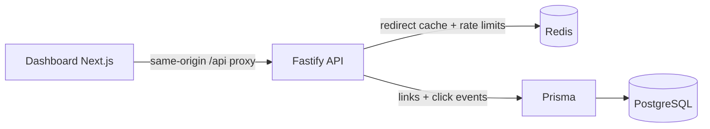

# Shortlink

[](./README.md)
[](./README.vi.md)

Shortlink kết hợp Fastify API, PostgreSQL được truy cập qua Prisma, Redis cho caching và rate limiting, cùng dashboard Next.js để quản lý link và xem phân tích lượt click.

## Demo trực tuyến

- Dashboard web: [short-link-1-46io.onrender.com](https://short-link-1-46io.onrender.com/)
- API: [short-link-wy7x.onrender.com](https://short-link-wy7x.onrender.com/)
- API health check: [healthz](https://short-link-wy7x.onrender.com/healthz)

Demo đang chạy trên Render free tier, vì vậy request đầu tiên có thể mất khoảng một phút để service thức dậy. Dashboard tự retry các request GET tạm thời lỗi nên không cần mở riêng URL API.

## Tính năng

- Tạo short link với mã tự sinh hoặc custom alias.
- Redirect qua Redis cache cho đường đi thường xuyên.
- Theo dõi tổng click, visitor duy nhất, referrer, trình duyệt, thiết bị và xu hướng theo ngày.
- Đặt thời gian hết hạn, bật hoặc tắt link mà không xóa lịch sử.
- Bảo vệ API bằng rate limiting lưu trên Redis.
- Quản lý link và xem analytics từ dashboard Next.js responsive.
- Chạy toàn bộ stack bằng Docker Compose hoặc từng tiến trình Node.js.

## Kiến trúc



Browser gọi Fastify API. Redis xử lý redirect cache và trạng thái rate limit, còn PostgreSQL là nguồn dữ liệu chính cho link và analytics. Prisma cung cấp lớp truy cập database có kiểu và migration.

## Quyết định kỹ thuật

| Quyết định | Lý do |
| --- | --- |
| Redis redirect cache | Giảm truy vấn database trên đường redirect và tăng tốc hot path. |
| PostgreSQL là nguồn dữ liệu chính | Lưu bền vững trạng thái link và analytics. |
| Hash địa chỉ IP | Ước tính visitor duy nhất mà không lưu IP thô. |
| Ghi nhận click không chặn redirect | Analytics chậm không được làm trễ redirect thành công. |
| Rate limiting trên Redis | Chia sẻ giới hạn giữa nhiều API instance. |

## Kiểm thử và CI

Backend có test cho redirect, validation, cache, rate limiting, analytics và health/readiness. GitHub Actions chạy các kiểm tra khi push và pull request.

```bash
npm run typecheck
npm test
npm run build
docker compose build
```

## Phạm vi demo và xác thực

Phiên bản portfolio hiện chưa triển khai authentication. Dashboard sử dụng demo workspace được seed sẵn (`demo@shortlink.local`); model `User` vẫn lưu quan hệ sở hữu link để thể hiện đúng data model. Khi mở rộng cho production, project cần bổ sung session hoặc token authentication và kiểm tra quyền sở hữu quanh link service hiện có.

## Chạy local bằng Docker

```bash
cp .env.example .env
docker compose up --build
```

Dashboard chạy tại `http://localhost:3000`; API cung cấp `/healthz` và `/readyz`.

## Chạy local bằng Node.js

Yêu cầu: Node.js 22+, PostgreSQL và Redis theo `.env.example`.

```bash
npm install
npm run db:generate --workspace @shortlink/backend
npm run typecheck
npm test
npm run build
npm run db:deploy --workspace @shortlink/backend
npm run dev
```

Lệnh npm run dev tự build và khởi động API, chờ API sẵn sàng rồi mới khởi động dashboard tại http://localhost:3000. Không cần mở thêm terminal cho API.

## Deploy

Có thể deploy API và web thành các service riêng biệt hoặc chạy toàn bộ stack trên Docker Compose. Cấu hình `DATABASE_URL`, `REDIS_URL`, `IP_HASH_SECRET` và origin của frontend trước khi chạy migration và khởi động service.

Render là host hiện tại của demo; VPS hoặc nền tảng container khác có thể dùng cùng Docker image.

## Cấu trúc project

```text
backend/src/
├── links.ts         # barrel tương thích cho link feature
└── links/
    ├── routes.ts    # Fastify handlers và response mapping
    ├── service.ts   # owner upsert và tạo short code an toàn khi trùng
    ├── cache.ts     # redirect cache và Redis rate limiting
    ├── analytics.ts # tổng hợp click và ghi nhận best-effort
    ├── validation.ts
    └── types.ts

frontend/src/
├── app/page.tsx     # state và bố cục dashboard
└── components/      # form, table, metric, chart và breakdown components
```
